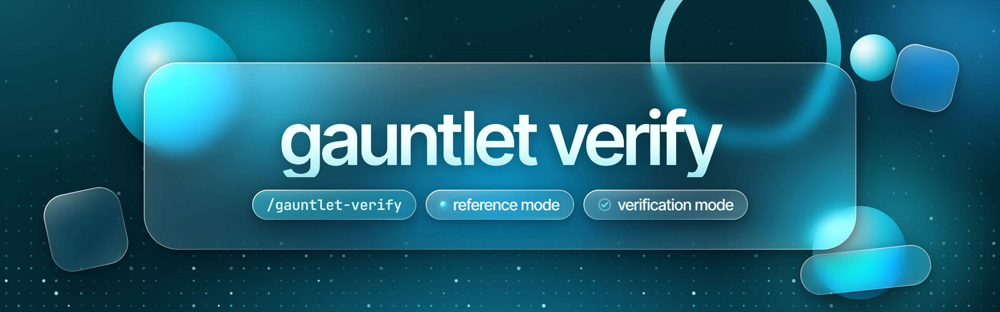

<p align="center">
  
</p>

# gauntlet-verify

A Claude skill for work that cannot afford to be mediocre or wrong.

- Point it at a shipped thing you want to match. It runs builders, an isolated critic, and blind judges until the judges can only tell your build from the original by brand, age, or adoption, never by craft.
- Point it at research that has to be right. It seats separate agents that never saw your reasoning, has them try to kill every load-bearing claim, and ships each claim labeled verified, reported, or unverified.

The Gauntlet Loop is [Matt Shumer's](https://github.com/mshumer) technique. This repo forks [robonuggets/gauntlet-loop](https://github.com/robonuggets/gauntlet-loop) and rebuilds it around how the loop gets used day to day.

## Quick start

It needs an agent that can run subagents or fresh contexts (sequential works), a browser or screenshot tool when the reference is a live page, and web access for verification mode. One full-formation round, measured once, used about 325k subagent tokens, so the skill writes a ceiling before it spends.

The skill is named `gauntlet-verify`, so it installs beside upstream's `gauntlet-loop` without replacing it. Keep only one of the two enabled, or both may answer the same request.

```bash
git clone https://github.com/EauDoon/gauntlet-verify
```

For every project (personal skills):

```bash
mkdir -p ~/.claude/skills && cp -r gauntlet-verify/.claude/skills/gauntlet-verify ~/.claude/skills/
```

For one project:

```bash
mkdir -p your-project/.claude/skills && cp -r gauntlet-verify/.claude/skills/gauntlet-verify your-project/.claude/skills/
```

For the Claude apps, turn on code execution, download [gauntlet-verify.zip](https://github.com/EauDoon/gauntlet-verify/releases/latest/download/gauntlet-verify.zip) from the latest release, and upload it under Customize > Skills. The apps trigger it from its description. To build the zip yourself, keep the skill folder at the zip root:

```bash
cd gauntlet-verify/.claude/skills && zip -r gauntlet-verify.zip gauntlet-verify
```

In Claude Code, call it by name or just work. It fires on its own when a build in progress falls short of a named reference, and on heavy research where being wrong costs money or reputation, or the result feeds a public statement or a decision someone will act on.

```
/gauntlet-verify build me a pricing page as good as Linear's
```

```
dig into whether this protocol's fee revenue really passed its rival's, it goes in a public thread this week
```

## Two modes

| | Reference mode | Verification mode |
|---|---|---|
| Fires when | A build in progress is not clearing a named, shipped reference | Several load-bearing facts, and being wrong costs money or reputation, or the result feeds a public statement or a decision someone will act on |
| The bar | A specific shipped artifact the build does not match today | The kill tests, run by agents that never saw the draft's reasoning |
| Seats | A builder per area, an isolated critic, blind judges | The drafting session, then isolated verifiers |
| Stops when | Judges name only identity tells, the delta stops moving, the user calls it, or the ceiling hits | Every claim is killed, fixed, or labeled, or the ceiling hits |

A **seat** is one isolated agent role. A **formation** is how many seats a job gets. A **ceiling** is the budget in rounds or tokens, written down before any isolated seat is spawned. Both modes set the formation and the ceiling before any isolated seat runs.

## Reference mode

A rubric is a lossy compression of a reference. It works when the criteria are mechanical and fails when the quality is experiential: a page that feels expensive, a deck that lands, prose that does not read as generated. So the skill does not write criteria. It names an artifact that already clears the bar.

1. Name the reference before building: a specific shipped thing the build does not match today, the one property being matched, how the judge will see it, the formation, and the ceiling. "Linear's settings page" passes. "Good design" does not. Your own best past work is the strongest reference of all.
2. Decompose and fan out: one builder per area that fails independently (structure, visual system, motion, copy, data, edge cases). The orchestrating session assembles mechanically; anything it is tempted to patch goes back to that area's builder.
3. Critic that never saw the build: fresh context, the artifact and the reference, nothing else. It names specific gaps, maps each to one area and one edit, and ranks by impact. No praise.
4. Blind judge: both artifacts, unlabeled, random order. The judge is told one is the original and one is an attempt, then asked which is the attempt and what gave it away.
5. Loop and report the delta, one line per round: the change in open craft tells and critic findings. A loop whose delta stops moving is finished; it stops and reports.
6. The user is the brake: no round cap. The ceiling from step 1 parks an unattended loop, and it ships nothing on its own.
7. Log the run to durable notes, so the cost estimates turn into measurements.

### The judge question

Upstream asks which one is better. That invites diplomacy. Asking only which one the original author made fails differently: a famous original is recognized on sight, so the pick measures recognition, not the gap. The first measured run here hit that second failure, and the judge question then in use was answered by brand recognition. Now every tell the judge names is tagged.

| Tell | Meaning | Fixable |
|---|---|---|
| Craft | Something in the artifact itself: spacing, copy, motion, a broken example | Yes, it becomes next round's brief |
| Identity | Age, adoption, ecosystem, brand, the things a new artifact cannot have | No edit reaches it |

| Judge says | Read |
|---|---|
| Spots the attempt and names a craft tell | Not there |
| Spots the attempt, names only craft tells that do not matter | Close, press the one property |
| Names only identity tells, picks the original as the attempt, cannot choose, or the panel splits | Done, ship it |

## Verification mode

The drafting session does its research and its own self-checks first. Then the skill writes a ceiling and seats verifiers who get the claims, where each came from, and a short brief, never the reasoning that produced them. The design follows an observation, not a measurement, from the author's long multi-agent research builds: each layer caught errors in the one below it and added errors only the next one caught, and no layer's confidence predicted its accuracy.

The brief tells each verifier which claims are already labeled unsourced (declared, not defects), which self-checks ran (to re-run, not trust), and which primary-data tools it can load. Then each verifier runs the kill tests on every claim:

1. Search for the direct contradiction.
2. Trace to the primary source. A chain that ends at an aggregator is unverified.
3. Recompute any number that can be recomputed.
4. Re-fetch every figure quoted from a live source and compare figure, source, and as-of date.
5. Check the date on every figure.
6. Label it: **verified** (one primary source, or two independent sources that are named-author reporting at established outlets or counterparty documents), **reported** (one such source), or **unverified** (everything else, including anything resting on aggregators).

Kills and survivals are asymmetric. One kill backed by a quote or a primary trace stands. A claim survives only if every test was run. Unverified claims can still ship, labeled, with what would settle them. If no isolated verifier could run, the deliverable says so.

## Formations

Spend follows consequence, not effort.

| Formation | Seats | When | Cost anchor |
|---|---|---|---|
| Light | The drafting session plus one isolated critic or verifier; one judge when the build is ready to ship | Default, whenever the stakes test fails | 100k to 150k tokens, estimated |
| Full | A builder or verifier per area or claim cluster, an isolated critic, 2 to 3 judges | Money, reputation, a public statement, a decision someone acts on, or "full gauntlet" | About 325k subagent tokens per round, measured once in reference mode; verification unmeasured |

The stakes test decides, whatever the area count. In reference mode, builders run on a cheaper workhorse model; only the critic and judges pay frontier prices. Judges come from at least two model families where the stack allows, because a same-family judge shares the priors that produced the gap. Escalation is automatic on stakes and always announced in one line.

## What breaks it

- A reference nobody can show the critic. The critic invents one and approves everything.
- A critic or verifier that shares the builder's context. It inherits the builder's satisfaction.
- Asking "which is better", or only "which is the original". The first invites diplomacy; against a famous reference the second measures recognition.
- Stills for a motion property. The static frame converges while the real gap stays open.
- An assembler that quietly patches. The fix belongs to the area's builder, or the critic's findings stop meaning anything.
- Changing the artifact while the critic or judges are reading it. The verdict cannot be attributed to a version.
- Unpinned seats. Some orchestrators do not pass the session's model choice to subagents, so check the model each agent actually ran on.
- Starting the loop and accepting round one. Fan-out prices for a single draft.
- Not logging. The next run pays for the same lesson.

## Measured so far

| Date | Run | Result |
|---|---|---|
| 08-08-2026 | Reference mode smoke test: a project README driven at [sharkdp/bat](https://github.com/sharkdp/bat)'s README, full formation | 1 round, 3 builders, 1 critic, 2 judges, about 325k subagent tokens, 8 minutes. Both judges NOT THERE, matching the critic. The critic caught an output block the assembler had doctored. The 400k ceiling parked the loop before round 2. |
| 08-08-2026 | Routing checks on earlier, longer descriptions, two blind seats | 23 of 24 correct, then 5 of 5 after a fix to the clause separating it from the research method. The current, shorter description drops that clause and has not been rerun. |

Light-formation costs stay estimates, and full verification mode stays unmeasured, until three runs of each are logged.

## What changed from upstream

| | [robonuggets/gauntlet-loop](https://github.com/robonuggets/gauntlet-loop) | This fork |
|---|---|---|
| Output | One paste-ready loop prompt, with an offer to run it here | Runs the loop in the current session |
| Modes | Build to a bar | Reference mode, plus verification mode for facts |
| Bar | Named, fetchable, comparable | Same, plus not matched today and one property at a time; your own past best counts |
| Judge question | The critic picks which one is better | Which one is the attempt, with every tell tagged craft or identity |
| Spend | Fan out every time; a budget line only if the user names one | Light or full formation set by stakes; a ceiling always written first |
| Stop | Ours wins the blind comparison, or the user stops | Only identity tells remain, the delta stops, the user stops, or the ceiling parks it |
| Memory | None | One log line per run, so estimates become measurements |
| Skill name | `gauntlet-loop` | `gauntlet-verify`, so it does not overwrite upstream |

## Repo layout

```
.claude/skills/gauntlet-verify/
└── SKILL.md              # the whole skill, one file
.github/workflows/
└── check.yml             # runs the check on pushes to main and on pull requests
evals/
└── README.md             # trigger and behavior cases
scripts/
└── check_skill.py        # frontmatter, dash, and link checks
assets/
├── banner.jpg
└── src/banner.html       # banner source
CHANGELOG.md
LICENSE                   # CC BY 4.0
README.md
.gitattributes            # LF line endings
.gitignore
```

## Credit

The Gauntlet Loop technique is **[Matt Shumer's](https://github.com/mshumer)**. He ran it in the [prompt](https://github.com/mshumer/Claude-of-Duty/blob/main/prompt.md) behind [Claude of Duty](https://github.com/mshumer/Claude-of-Duty) and named it in [his write-up](https://somethingbig.ai/gauntlet-loop) on 27-07-2026. The harsh critic, the blind side-by-side comparison, and the refusal to stop until the work holds up all come from that prompt.

The original skill packaging is by Jay E at [RoboNuggets](https://robonuggets.com), in [robonuggets/gauntlet-loop](https://github.com/robonuggets/gauntlet-loop). This fork changes it substantially; see [CHANGELOG.md](CHANGELOG.md).

Related reading: [Anthropic on building effective agents](https://www.anthropic.com/engineering/building-effective-agents) covers the evaluator-optimizer workflow. The loop applies it to bars that cannot be written as criteria.

## License

[CC BY 4.0](LICENSE), as upstream. Free to use with attribution.
